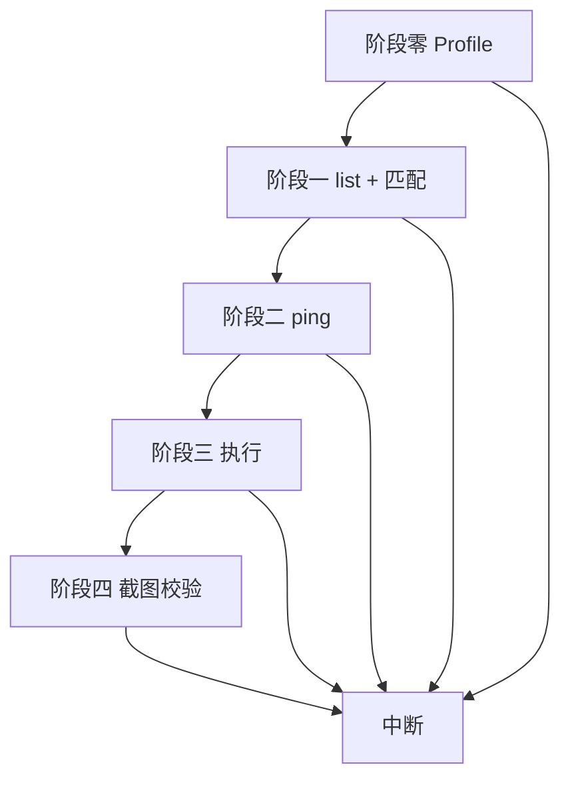

# unity-cmd — Agent 指南（中文）

仓库源：`docs/unity-cmd-skill/`。入口 [SKILL.md](../SKILL.md)。架构速查 [AGENTS.md](../../AGENTS.md)。

## 阅读说明

- **SKILL.md**：五条前提 + 流程概览 + profile 路由（每次任务先扫一眼）。
- **本指南**：唯一完整操作说明（catalog、阶段表、错误码、示例）。
- 命令目录只来自 `unity-cmd --profile <name> list`；**禁止**手拼 `~/.unity-cmd/cache/...` 路径。

---

## 环境前置

1. Unity 工程已安装 `com.airuxul.unity-connector`（[unity-connector/README.zh-CN.md](../../../unity-connector/README.zh-CN.md)）
2. 目标实例已启动，Console 有 HTTP 地址（如 `http://127.0.0.1:6547/`）
3. CLI：`cd unity-cmd && npm install && npm link`（可选）

**适用：** 编译、Play、控制台、profiler、截图、runtime `echo`、改 connector 后重编译、CI/脚本自动化。

---

## 前提条件与中断规则

### 中断对话

本轮**无法继续**时：向用户说明原因（`error_code`、`hint`、已做步骤）→ **停止**；不切换 profile、不用 Unity MCP、不臆造命令、不继续其它子任务。

### 五条前提

| # | 前提 | 不满足时 |
|---|------|----------|
| 1 | 存在 `editor`、`editor-play` profile（缺则 create，见下节） | create 失败 → **中断** |
| 2 | `profile show <profile>` 成功；远程命令带 `--profile` | **中断** |
| 3 | 已 `list` 且 catalog **未过期** → 在 `commands` 中匹配 | 无匹配 → [无匹配时](#无匹配命令) → **中断** |
| 4 | 未过期但未命中 → `list --refresh-catalog` → 再匹配 | 仍无匹配 → **中断** |
| 5 | 阶段二 `ping`、阶段三执行、阶段四截图（若适用）成功 | **中断** |

### 无匹配命令

1. 说明 connector **不提供**该能力  
2. 从 catalog 列 **2～5** 个可能相关的 `commands[].name`  
3. 建议换表述或扩展 `unity-connector`  

未匹配到命令时**不得**执行远程调用。

### 其它中断情形

| 情形 | 告知要点 |
|------|----------|
| profile（规则 1、2） | 缺哪个 profile、create 结果 |
| 实例不可达（阶段二） | ping 已重试、connector / Console HTTP |
| 执行失败（规则 5） | `error_code`、`hint` |
| 截图无效（阶段四） | 可能为空白 Scene |

### 约束

- 命令与参数仅来自 catalog；禁止臆造。  
- 目录仅来自 `list`；禁止手拼用户目录路径。  
- `compile` / `play` / `stop` 仅 profile **`editor`**。  
- 用户要求「刷新命令」→ 对该 profile 执行 `list --refresh-catalog` 后再匹配。

---

## CLI catalog

通过 **`unity-cmd --profile <profile> list`** 获取 JSON。CLI 会将目录写入用户目录；`cache_path` 仅供查看，Agent **不必**读盘拼路径。

### 字段（匹配时关注）

| 字段 | 用途 |
|------|------|
| `expires_at` | **过期判断**：`now >= expires_at` → 须再 `list` 或 `list --refresh-catalog` |
| `catalog_expired` | 与上一致的布尔值（由 `list` 返回） |
| `updated_at` | 上次写入 catalog 的时间 |
| `commands` | 匹配：`name`、`aliases`、`description`、`params`、`scope` |
| `alias_to_command` | 别名 →  canonical 名 |
| `catalog_version` / `connector_build` | CLI 在线校验用；匹配阶段以 `expires_at` 为主 |

### 过期判断（Agent）

```text
未 list / catalog_expired / now >= expires_at  →  list（或 --refresh-catalog）
否则                                           →  用本次 list 的 commands 匹配
```

在线执行前 CLI 仍会 `ping` 并核对 `catalog_version`；**匹配阶段**只看 `expires_at` / `catalog_expired`。

### 匹配 scope

- **Editor 域：** `scope` 为 `editor` 或 `any`  
- **Runtime 域：** `scope` 为 `runtime` 或 `any`

---

## Profile 与 HTTP

Profile 文件：`~/.unity-cmd/profiles/<name>.json`。远程命令需 `--profile` 或 `UNITY_CMD_PROFILE`。

**阶段零缺 profile 时创建（`--no-verify`）：**

```bash
unity-cmd profile list
unity-cmd profile create editor --host 127.0.0.1 --port 6547 --host-kind editor --no-verify
unity-cmd profile create editor-play --host 127.0.0.1 --port 6794 --host-kind editor_play --no-verify
# Development Build 运行时可选：
unity-cmd profile create package-play --host 127.0.0.1 --port 6795 --host-kind player --no-verify
```

| Profile | host-kind | 端口 | 用途 |
|---------|-----------|------|------|
| `editor` | `editor` | 6547 | 编辑模式工具 |
| `editor-play` | `editor_play` | 6794 | Editor 播放中 runtime |
| `package-play` | `player` | 6795 | Dev Build（Release 无 HTTP） |

| profile | 可用 scope | 不可用 |
|---------|------------|--------|
| `editor` | `editor`、`any` | runtime 专用 → `editor-play` |
| `editor-play` | `runtime`、`any` | `compile`、`play`、`stop` 等 |
| `package-play` | `runtime`、`any` | 同上 |

- `play` / `stop` 仅 **`editor`**  
- 播放中截图、profiler 仍用 **`editor`（6547）**  
- 播放中 runtime `echo` 用 **`editor-play`**；包体用 **`package-play`**

---

## 操作流程

按序执行；失败默认 **中断**（见上文）。



### 判定域（阶段零 0.3）

| 用户意图（示例） | 域 | profile |
|------------------|-----|---------|
| 编辑器、编译、控制台、截图、非播放 | editor | `editor` |
| 运行时、播放中、包体 | runtime | `editor-play` 或 `package-play` |

不明：问用户，或 `unity-cmd --profile editor state`（`is_playing`）。

### 阶段零：Profile（规则 1、2）

| 步骤 | 操作 | 失败 → |
|------|------|--------|
| 0.1 | `profile list` | **中断** |
| 0.2 | 缺则 create `editor` / `editor-play` | **中断** |
| 0.3 | 判定域 → 确定 profile | 仍不明 → **中断** |
| 0.4 | `profile show <profile>` | **中断** |

### 阶段一：list + 匹配（规则 3、4）

| 步骤 | 操作 | 失败 → |
|------|------|--------|
| 1.1 | `unity-cmd --profile <profile> list` | **中断** |
| 1.2 | 若 `catalog_expired` 或 `now >= expires_at` → 再 `list` / `--refresh-catalog` | — |
| 1.3 | 在 `commands` 中匹配（见 [CLI catalog](#cli-catalog)） | → 1.4 |
| 1.4 | 未命中 → `list --refresh-catalog` → 再匹配 | 仍无 → [无匹配命令](#无匹配命令) → **中断** |

### 阶段二：ping（规则 5）

| 步骤 | 操作 | 失败 → |
|------|------|--------|
| 2.0 | runtime + `editor-play`：须 `editor state` 且 `is_playing` | **中断** |
| 2.1 | `ping` | 2.2 |
| 2.2 | 等 5s，重复最多 6 次 | **中断** |

`Unity.exe` 存在 ≠ `ping` 成功。

### 阶段三：执行（规则 5）

| 步骤 | 操作 | 失败 → |
|------|------|--------|
| 3.1 | `unity-cmd --profile <profile> <已匹配命令> [flags…]` | **中断** |
| 3.2 | HTTP 202：等轮询，`ok` / 退出码 | **中断** |
| 3.3 | 若为 `screenshot` | → 阶段四 |

布尔：`--compile true`。长超时：`--timeout 90000`。

### 阶段四：截图（规则 5）

profile 须 **`editor`**。PNG 异常或大面积单色 → 说明可能空白 → **中断**。

### Play 串联示例

```text
editor      → play
editor-play → echo     # 须 is_playing
editor      → screenshot --view game --output_path …
editor      → stop
```

---

## 命令示例

```bash
unity-cmd --profile editor state
unity-cmd --profile editor compile
unity-cmd --profile editor console --type error,warning --lines 20
unity-cmd --profile editor play
unity-cmd --profile editor screenshot --view scene --output_path Screenshots/scene.png
unity-cmd --profile editor stop
unity-cmd --profile editor refresh --compile true --timeout 30000
```

**仅本地（无需 profile）：** `unity-cmd help` · `unity-cmd profile list|show|create|set|delete`

---

## 错误码

`ok: false` 时写入中断说明；**本轮不重试、不换 profile**。

| `error_code` | 含义 |
|--------------|------|
| `NO_PROFILE` | 完成阶段零 |
| `NO_INSTANCE` / `CONNECTION_FAILED` | ping 已重试；检查 connector |
| `SCOPE_MISMATCH` | 换正确 profile |
| `CATALOG_FETCH_FAILED` | 无法 `list` |
| `DEFERRED_COMMAND_FAILED` | 可附 `console --type error,warning` |
| `COMMAND_STATUS_TIMEOUT` | 报告已用 `--timeout` |

---

## 环境变量

| 变量 | 说明 |
|------|------|
| `UNITY_CMD_PROFILE` | 默认 profile |
| `UNITY_CMD_TIMEOUT_MS` | 默认超时 |
| `UNITY_CMD_TOKEN` | 可选鉴权 |

---

## 延伸阅读

| 文档 | 内容 |
|------|------|
| [ARCHITECTURE.md](../../ARCHITECTURE.md) | 架构 |
| [unity-cmd/docs/IMPLEMENTATION.md](../../../unity-cmd/docs/IMPLEMENTATION.md) | CLI 实现 |

## 检查清单

- [ ] 规则 1～2：profile 就绪  
- [ ] 规则 3～4：`list` + 匹配（或已中断）  
- [ ] 阶段二：`ping` 成功（或已中断）  
- [ ] 规则 5：执行 / 截图完成（或已中断）
